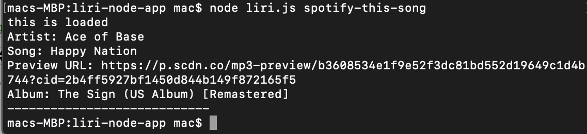
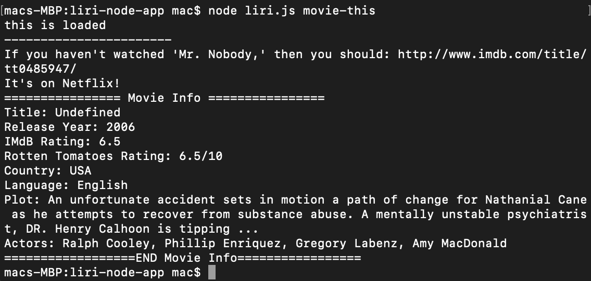
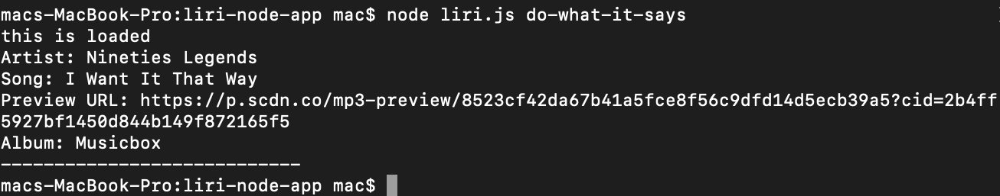
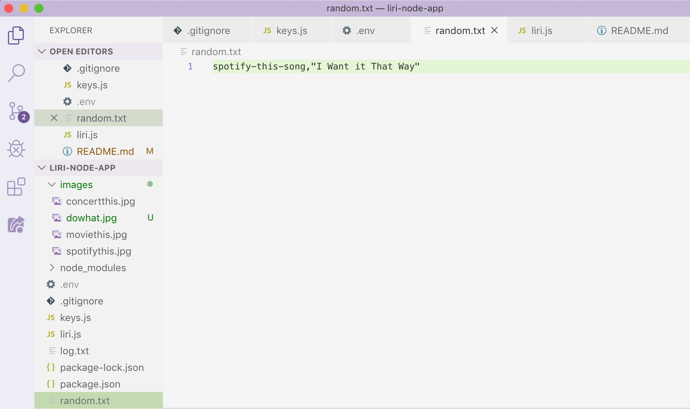

# LIRI App 

A command line Node app that returns data. LIRI stands for Language Interpretation and Recognition Interface. We can find information on concerts, music, and movies. 

## Deployment

* Clone repo.
* Run npm install.
* Click submit
* At command prompt run node liri.js <pass in an instruction from above>

## How It Works

Enter any of the following commands, along with a search term:
* concert-this  
  When you enter concert-this with an artist name (this example is "concert-this Billie Eilish") an API call will be made to return data on the upcoming concert dates and venues, and locations the artist will be performing at.

* spotify-this-song  
  When you enter spotify-this-song with a song name (this example is "spotify-this-song Thriller") an axios call will be made to return data on songs of that title.

* spotify-this-song without query
  On the other hand, if you only enter spotify-this-song without a song name it will make an axios call returning "The Sign" by Ace of Base as the song data.

* movie-this  
  When you enter movie-this with a movie title (this example is "movie-this Moana") an axios call will be made to return data on a movie of that title.

* movie-this without query
  On the other hand, if you only enter movie-this without a title it will make an axios call returning "Mr. Nobody" as the movie data.
  
* do-what-it-says
   When you enter do-what-it-says an axios call will be made to return data based on the command written in the file random.txt shown below.

## Built With

* Node.JS
* Bands In Town API
* Node Spotify API
* OMDB API
* Axios
* Moment.js
* DotEnv
* jQuery
* Javascript

## Credits

I referenced the following resources for this project:

* Penn LPS Coding Bootcamp Course Material
* https://momentjs.com/

## License

&copy; Alissa Yamazaki

